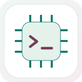
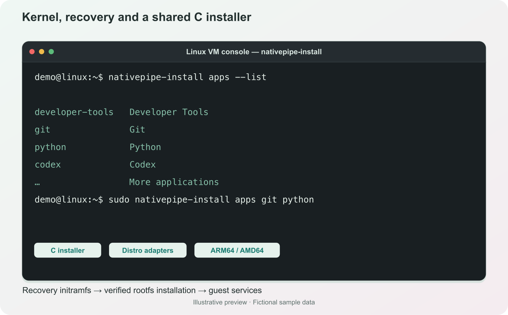

# LinuxKit for LinPortal



Linux boot resources and guest services for [LinPortal](https://github.com/shih-liang/LightHouse).
The recovery initramfs starts a modular C installer, prepares the selected Linux
root filesystem, and hands off to the distribution's init. Installed guest
services connect the VM to LinPortal's management and file-operation interfaces.



*Illustrative preview, sample data. Installer commands in a VM console; the application list is an excerpt.*

## Components

| Location | Responsibility |
| --- | --- |
| [`nativepipe-init/`](nativepipe-init/README.md) | Recovery PID 1, normal boot handoff, disk preparation and installer startup |
| [`guest-platform/`](guest-platform/README.md) | Shared guest protocol, bootstrap, guest agent, C installer and service files |
| [`adapters/`](adapters/README.md) | Approved distribution series, rootfs discovery and application choices |
| [Kernel and recovery workflows](.github/workflows/) | ARM64 kernel variants and the static recovery initramfs |

The installation catalog supports Alpine, Debian, Ubuntu, Fedora and Arch
root systems with ARM64 or AMD64 userspaces. On Apple silicon, AMD64 roots run
through Rosetta on the ARM64 VM kernel, using the 4 KiB kernel variant.
Distribution release series and bootstrap snapshots are pinned in the
[catalog](adapters/README.md); advancing them requires installation and runtime validation.
See [installation ownership](guest-platform/INSTALLATION.md) for the root
architecture, verified payload and recovery lifecycle.

## Install applications by name

On an installed Linux VM:

```sh
nativepipe-install apps --list
sudo nativepipe-install apps git python
```

The shared C component selects the distribution's package manager and executes
reviewed presets where needed. `--list` reports applications available on that
system. See the [application table and installer usage](guest-platform/installer/APPLICATIONS.md).

## Build and test

Keep a [NativePipe](https://github.com/shih-liang/NativePipe) checkout beside this
repository, or set `FILE_RPC_DIR` to its `common/file_rpc` directory.
Host tests require a C compiler and Python 3; Zig cross-compiles static guest
binaries for ARM64 and AMD64.

```sh
make platform-test
make platform-build
```

Kernel and initramfs builds run in the release workflows. The root Makefile's
`kernel` and `initramfs` targets do not build them locally. LinPortal downloads
these boot resources and packages the separately built guest runtime from this
checkout. See [guest builds and releases](guest-platform/README.md) and
[recovery and kernel workflows](nativepipe-init/README.md).

Dependency versions and checksums are recorded in `DEPENDENCY_VERSIONS` and
`KERNEL_VERSION`. License information is in [`LICENSES/`](LICENSES/README.md)
and the [guest notices](guest-platform/LICENSES/README.md).
